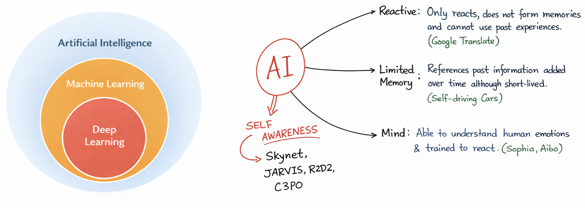
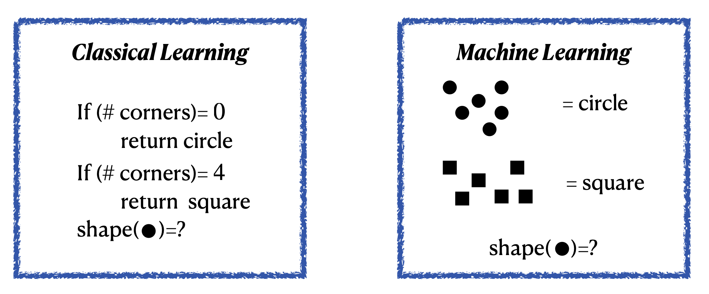

# A mini course in Machine Learning for HSF training
## Overview

```{figure} ../StringE.png
:align: center
:width: 180px

<div style="text-align:center;">
<strong>String-E welcomes you to this course</strong>
</div>
```

These particular notes are built upon the **A mini course in Machine Learning for Physicists** notes available here:  [A mini course in Machine Learning for Physicists](https://chattopadhyaya.github.io/ml_for_physics). Given our modern day use of all things electronic, *you can run, you can hide but you cannot escape ML*. From smart phones to smart toothpastes, ML is everywhere. The aim of these development is to help physicists to wrap their head around all things ML.


In this course, "*we're here for a good time, not a long time*" so let's first learn what this course in **NOT** for

- We are not going to learn facial recognition.
- Not going to develop a algorithm that predicts our mood better than Youtube or Netflix.
- No self-driving cars here.
- Not even making AI driven music or art.
- Nor would we learn to beat Magnus Carlsen in chess.
- and million more things, that we are not going to learn.

The main objective of this course are

- To introduce you to the basics of Machine learning with examples.
- To develop a sense of statistics/data science algorithms that goes under the hood of a ML model.
- Explain the terminology of machine learning.
- Introducing you to some **Python** frameworks to start building your first *Machine*.
- Getting familiarize with basic ML models that are although very common but can serve as a basic starting point.
- Getting you prepared to learn on your own once this course is over.


With all these let us first have some basic motivation for learning ML in the context of our pursuit of artificial intelligence.

## Aritificial Intelligence and Machine Learning

- Aritificial intelligence leverages computers and machines to mimic the problem solving and decision making capabilities of the human mind.

```{figure} images/AI_vs_hum.png
:align: center
:width: 650px
```

### Machine Learning

- Machine learning is more dependent on human intervention to learn. Human experts determines the hierarchy of features to understand the difference between data inputs, usually requiring more structured data to learn.

- **Deep learning** in general does not require that much structuring of data and extract features without much of a human intervention. <br>

<br>



- In **classical** programming, we the developers need to understand the aspect of the problem we are trying to solve, and to know exactly what all the rules are to make it to the solution

```{admonition} Intuitively
:class: tip

**Machine Learning** $\equiv$ **Learning from example**
```

<br>

Example: <span style="color:blue">Distinguish Squares and Circles</span>



<br>

- The standard coding algorithms that we use are constrained by statements like *if*, *do-while*, *for* etc. Even a very intelligent coder can only cover a finite number of scenarios through these.

Example: <span style="color:blue"> Self driving cars </span>


<span style="color:red"> **What if:** There is a human on a wet road and the signal in green?? </span>


>  <span style="color:blue"> *Since our real world has infinite possibilities, explicit codings are not faithful or even practical*. </span> 

## Summary of machine learning
In a lot of sense ML can be summarised as the following

```{figure} images/ML_meme.png
---
height: 300px
name:   ML_meme
align:  center
---
"Image source: https://www.meme-arsenal.com/en/create/meme/1868835"
```

---
## Rules for this mini course

- Each of the following chapter will have a [](https://youtu.be/5LB_y-nudGU?si=MYDYvubUH8qLpm89) button. Clikcing on the button will open up the Jupyter Notebook in Google Collab, where you can modify and run the files as you wish. Remember that the only way to learn is to start first.

- There are questions in the jupyter lab notebooks, where the answers are hidden. But a single click would unveil the answers. The mini course will work on an *honour-system*, you are not allowed to open the answers before you are told to do so. 

- Some pages in this mini course allow you to **run Python directly inside the webpage**. When such a page first loads, look for the following button near the top of the page:

  

  Click this button first to turn on the interactive Python environment. The first startup may take a few moments while the browser prepares the kernel and loads the required packages.

- Once the interactive environment is ready, runnable code cells will show controls like these:

  

  The **play button** runs that particular code cell directly in your browser. The button next to it can be used to collapse or hide the code area.

- For interactive figures, sliders, and widgets, first turn on the interactive environment using the power button, and then press the play button on the corresponding code cell. Some cells may depend on earlier cells, so it is usually best to run them in order.

- Unfortunately, the in-browser `Pyodide` setup described above is not suitable for actually **training the machine-learning models** used later in this mini course. Therefore, whenever you reach pages involving ML applications and model training, please run the corresponding notebook either in **Google Colab** or on your **local machine**.

- If some of the code cells do not run in Google Colab, check the warning or error message for missing packages and install them in a new cell using  
  `!pip install <missing-package-name>`  
before running the notebook again.


---

## Running the course on your own computer

```{important}
You **do not need to install anything locally** to follow this mini course. The lecture notebooks and exercises can be opened and run directly in **Google Colab**.

To run and save notebooks interactively in Google Colab, you will need to be signed in with a **Google account** (for most people, this will simply be their Gmail account).

However, especially for the exercises, I strongly encourage you to also set up the course on your own computer. Installing the software, creating an environment, opening Jupyter, running the notebooks, and occasionally fixing something that breaks are all part of getting real **hands-on experience** with scientific computing.

**Colab is the easy road. Setting things up locally teaches you how the road was built.**
```

### Why do we need a Python environment?

A Python project usually depends on several external packages: `numpy`, `pandas`, `scikit-learn`, `torch`, and so on. Different projects may require different packages or even different versions of Python.

A **Python environment** gives one project its own isolated collection of Python and its packages. This prevents the packages used for this course from interfering with packages used by your other projects or your OS itself.

For example, you could have

```text
Environment A → ML course → Python + NumPy + PyTorch + scikit-learn

Environment B → another research project → Python + completely different packages
```

without the two projects fighting with each other.

There are several ways of creating environments. Below I give two options:

1. **Using Conda** — recommended if you already have Conda or are happy to install it.
2. **Using Python's built-in `venv`** — a lighter option that does not require Conda.

You only need to follow **one** of these two routes.

---

## A note for Windows users

If you are using **Windows**, you have two possible ways of following the instructions below:

1. Use Windows directly through **PowerShell** or **Command Prompt**. Windows-specific commands are given below whenever they are different.
2. Use the **Windows Subsystem for Linux (WSL)**, which gives you a Linux terminal inside Windows.

For scientific computing, WSL can be very convenient because most commands then look almost exactly like the Linux commands you will encounter on servers, computing clusters, and many research machines.

```{note}
A small disclaimer from your instructor: I have considerably less experience fighting with Windows than with Linux/macOS, so the Windows instructions may contain a few more hidden Orcs than the rest of this course.

If something behaves mysteriously, WSL is often a good escape route. And if all else fails, Google Colab remains our emergency eagle out of Mordor.
```

### Installing WSL

If you already have WSL installed, you can skip this part.

Otherwise, open **PowerShell as Administrator**:

- Search for `PowerShell` from the Windows Start menu.
- Right-click it.
- Choose **Run as administrator**.

Then run

```text
wsl --install
```

Restart your computer when Windows asks you to.

By default, WSL will install an **Ubuntu Linux** environment.

After restarting, open **Ubuntu** from the Start menu. The first time it starts, you will be asked to create a Linux username and password.

You can check that WSL is installed by running the following from PowerShell:

```text
wsl --list --verbose
```

For more information, see the official Microsoft instructions:

[Installing WSL on Windows](https://learn.microsoft.com/en-us/windows/wsl/install)

Once you are inside the Ubuntu/WSL terminal, update the Linux package information:

```bash
sudo apt update
```

and install some basic tools that we will need:

```bash
sudo apt install python3 python3-pip python3-venv git -y
```

From this point onward, if you are using WSL, you can simply follow the **macOS/Linux/WSL** commands given below.

```{tip}
If you use WSL, I recommend keeping the course repository inside your Linux home directory rather than mixing the Python environment with random Windows folders.

For example, open Ubuntu and start from

```bash
cd ~
```

before cloning the repository.
```

---

## First: Get the course files

This part is **common to both installation methods**. You only need to clone the course repository once.

Open a terminal:

- On **macOS/Linux**, use your normal terminal.
- On **Windows**, use PowerShell or Command Prompt.
- If you installed **WSL**, open your Ubuntu terminal.

First make sure that Git is available:

```bash
git --version
```

If Git is installed, this should print a version number.

Now clone the course repository:

```bash
git clone https://github.com/chattopadhyayA/ml_course.git
```

Then move inside the repository:

```bash
cd ml_course
```

You should now be inside a directory containing files and folders such as

```text
myst.yml
requirements.txt
content/
content_nb/
exercises/
```

The lecture notebooks shown during the class are inside `content/`, class exercises are in `content_nb/`, while the exercise notebooks are inside `exercises/`.

```{important}
From this point onward, all installation commands should be run **from inside the `ml_course` directory**, unless explicitly stated otherwise.
```

Now choose **one** of the two environment setups below.

---

## Option A: Setting things up with Conda

Conda is both an **environment manager** and a **package manager**. One useful feature is that we can ask Conda to create an environment with a particular Python version instead of relying on whichever Python happens to be installed on the computer.

If you do not already have Conda, install either **Miniforge** or **Miniconda** first. For Miniconda, you can follow the official installation guide here:

[Miniconda installation guide](https://www.anaconda.com/docs/getting-started/miniconda/install)

After installation, open a new terminal and check that Conda is available:

```bash
conda --version
```

If this prints a version number, we are ready.

### 1. Create a new environment

For this course, let us call the environment `rivendell`:

```bash
conda create -n rivendell python=3.11 -y
```

This creates a separate Python installation specifically for this course.

Every journey needs a safe place from which to begin, and ours begins in **Rivendell**.

### 2. Activate the environment

```bash
conda activate rivendell
```

You should now see something similar to

```text
(rivendell) $
```

at the beginning of your terminal prompt.

That `(rivendell)` is important: it tells you that commands such as `python` and `pip` are now using the course environment.

### 3. Install the packages used in the course

First update `pip`:

```bash
python -m pip install --upgrade pip
```

Then install everything listed in the `requirements.txt` file:

```bash
python -m pip install -r requirements.txt
```

The installation of PyTorch and related packages may take a little while.

### 4. Make the environment visible to Jupyter

JupyterLab and the Python environment that runs your code are actually two separate things. To make our `rivendell` environment appear explicitly as a choice inside JupyterLab, we register it as a **Jupyter kernel**.

Run:

```bash
python -m ipykernel install --user --name rivendell --display-name "Python (Rivendell)"
```

You can check that the kernel was registered successfully with

```bash
jupyter kernelspec list
```

You should see an entry called `rivendell`.

Now Jupyter knows that it can use the Python installation and packages inside our `rivendell` environment.

### 5. Start JupyterLab

Make sure that you are still inside the activated `rivendell` environment and inside the `ml_course` directory, then run

```bash
jupyter lab
```

A browser window should open with the JupyterLab interface.

Open the notebook you want to work with. If Jupyter asks you to select a kernel, choose

```text
Python (Rivendell)
```

You can also change the kernel later from the **Kernel** menu in JupyterLab.

```{important}
Before running the notebook, check that the selected kernel is **Python (Rivendell)**. Otherwise Jupyter may use a different Python installation that does not contain the packages you just installed.
```

### 6. When you are finished

You can leave the environment with

```bash
conda deactivate
```

The next time you work on the course, you do **not** need to install everything again.

Simply go back to the repository, activate Rivendell, and start JupyterLab:

```bash
cd ml_course
conda activate rivendell
jupyter lab
```

and you are back where you left off.

---

## Option B: Setting things up without Conda

Python itself contains a lightweight environment system called `venv`.

Unlike Conda, `venv` does not install a separate Python version for you. It starts from a Python installation that is already present on your computer and creates an isolated place for the packages used by this project.

### Check that Python is installed

On **macOS, Linux, or WSL**, run:

```bash
python3 --version
```

On **Windows**, try:

```text
py --version
```

or, depending on your Python installation,

```text
python --version
```

For this course, Python **3.11** is a safe choice.

### 1. Create the environment

Make sure that you are inside the cloned `ml_course` directory.

On **macOS, Linux, or WSL**, run

```bash
python3 -m venv rivendell
```

On **Windows PowerShell or Command Prompt**, run

```text
py -m venv rivendell
```

This creates a directory called `rivendell` containing the isolated environment.

Notice that both the Conda and `venv` approaches use the same environment name. Regardless of which road you choose, we all eventually arrive at **Rivendell**.

### 2. Activate it

On **macOS, Linux, or WSL**:

```bash
source rivendell/bin/activate
```

On **Windows PowerShell**:

```text
rivendell\Scripts\Activate.ps1
```

On **Windows Command Prompt**:

```text
rivendell\Scripts\activate.bat
```

If PowerShell refuses to run the activation script because of its script-execution settings, you can either use **Command Prompt** instead or use **WSL** and follow the Linux instructions.

After activation, you should normally see something like

```text
(rivendell) $
```

at the beginning of your terminal prompt.

### 3. Install the course packages

First update `pip`:

```bash
python -m pip install --upgrade pip
```

Then install the packages required by the course:

```bash
python -m pip install -r requirements.txt
```

### 4. Make the environment visible to Jupyter

JupyterLab and the Python environment that runs your code are actually two separate things. To make our `rivendell` environment appear explicitly as a choice inside JupyterLab, we register it as a **Jupyter kernel**.

Run:

```bash
python -m ipykernel install --user --name rivendell --display-name "Python (Rivendell)"
```

You can check that the kernel was registered successfully with

```bash
jupyter kernelspec list
```

You should see an entry called `rivendell`.

Now Jupyter knows that it can use the Python installation and packages inside our `rivendell` environment.

### 5. Start JupyterLab

Make sure that you are still inside the activated `rivendell` environment and inside the `ml_course` directory, then run

```bash
jupyter lab
```

A browser window should open with the JupyterLab interface.

If you are using **WSL** and a browser does not open automatically, look at the terminal output. Jupyter will print an address similar to

```text
http://localhost:8888/lab?token=...
```

Copy that address and open it in your normal Windows web browser.

Open the notebook you want to work with. If Jupyter asks you to select a kernel, choose

```text
Python (Rivendell)
```

You can also change the kernel later from the **Kernel** menu in JupyterLab.

```{important}
Before running the notebook, check that the selected kernel is **Python (Rivendell)**. Otherwise Jupyter may use a different Python installation that does not contain the packages you just installed.
```

### 6. Leaving the environment

When you are finished:

```bash
deactivate
```

The environment stays on your computer. You do **not** need to recreate or reinstall it every time.

The next time you want to work on the course:

On **macOS, Linux, or WSL**:

```bash
cd ml_course
source rivendell/bin/activate
jupyter lab
```

On **Windows PowerShell**:

```text
cd ml_course
rivendell\Scripts\Activate.ps1
jupyter lab
```

On **Windows Command Prompt**:

```text
cd ml_course
rivendell\Scripts\activate.bat
jupyter lab
```

---

## Check that everything works

After installing the packages, you can do a quick test from the terminal:

```bash
python -c "import numpy, pandas, scipy, sklearn, matplotlib, seaborn, torch; print('Everything looks good!')"
```

If you see

```text
Everything looks good!
```

your basic setup is ready.

You can also verify that Jupyter can see Rivendell:

```bash
jupyter kernelspec list
```

and make sure that `rivendell` appears in the output.

```{tip}
Do not worry if setting up a local environment feels slightly confusing the first time. Learning how to create an environment, install packages, and find out why Python cannot find a package is itself an important scientific-computing skill.

And remember: if the Balrog of dependency conflicts appears, Google Colab is still there as the Bridge of Khazad-dûm.
```

#### Acknowledgements

No journey through the lands of Machine Learning is completed alone.

A very big thank you to [Meghanto](https://github.com/meghanto) for writing the Thebe-Lite patch and updating the deployment workflow, which helped make the in-browser notebook experience smoother, kinder, and far less like crossing the Mines of Moria without a torch. Without this update, some of our notebooks might still be lost somewhere between missing packages and mysterious kernel errors.

I would also like to warmly thank the mentors of the HSF training programme for their guidance and suggestions shaping this mini course: specially [Aashirvad](https://github.com/aashirvad08) and [Karan](https://github.com/KaranSinghDev). Any bright paths in this material were lit with help from the fellowship; any remaining bugs, typos, or cursed cells are mine to carry.

More acknowledgements will be added soon — this section is still on its way to Mordor.


```{note}
With all these, our small fellowship is now ready to proceed.

If you find this Jupyter Book helpful in your project, thesis, or article, you are welcome to cite the main resource:

https://chattopadhyaya.github.io/ml_for_physics

From Rivendell to the ends of the Earth, this book is free to all who wander.

I would also greatly appreciate your feedback. You can find my contact details on my homepage:

https://chattopadhyaya.github.io
```

